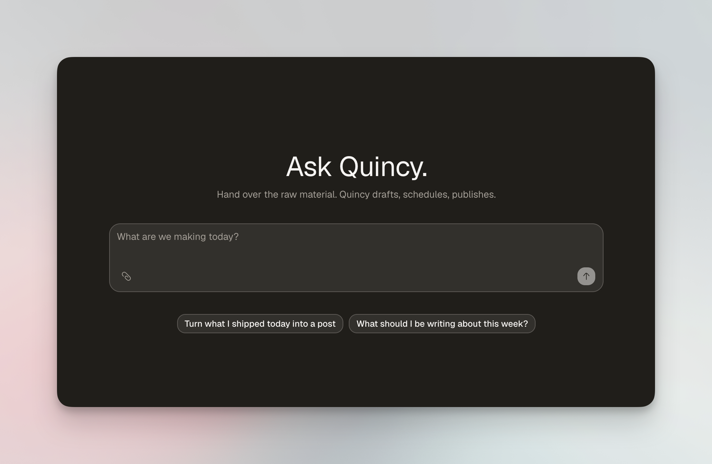

<h3 align="center">Quincy</h3>

    An AI Head of Content you employ.
     
    <a href="https://hirequincy.com"><strong>Learn more »</strong></a>
     
     
    <a href="#introduction"><strong>Introduction</strong></a> ·
    <a href="#features"><strong>Features</strong></a> ·
    <a href="#tech-stack"><strong>Tech Stack</strong></a> ·
    <a href="#self-hosting"><strong>Self-hosting</strong></a> ·
    <a href="#contributing"><strong>Contributing</strong></a>

  
  

 

## Introduction

Quincy is an **AI Head of Content you employ**. You give it raw material — a
voice note on a walk, a meeting you recorded, a pull request you merged — and
it drafts in your voice, schedules, and publishes. The chat is the primary
interface; every page is a window onto the same agent state.

One rule holds everywhere: **Quincy drafts, you send.** It publishes in your
name, so nothing goes out without your approval.

The bet behind the product: feeds stopped being social graphs and became
interest graphs, so a post lives or dies on its own merit, not on follower
count. The scarce resource is original thought — everything else is
adaptation. One expensive input, many cheap adaptations, per channel, in your
voice. [`docs/vision.md`](docs/vision.md) is the full argument, including
what we deliberately do not build: a dashboard, a thousand faceless accounts,
follower charts, autoposting without approval.

## Features

- **Studio**: a chat-first workspace — talk to Quincy, and every other page is a window onto the same state
- **Sources**: raw material in — voice notes, recorded meetings, and merged pull requests become drafts
- **Channels**: adapted writing out — per-channel rewrites for X and LinkedIn, never one string fanned out
- **Approve → schedule → publish**: every draft waits for you; nothing posts on its own
- **Brain**: a compounding memory of your voice, your ideas, and what you have already said
- **Rhythm**: the work Quincy does on its own schedule — it drafts, you send
- **Lineup**: when it goes out
- **Numbers**: what happened, measured against your own baseline — no follower charts
- **Cuts**: video clips rendered with Remotion

## Agent access (MCP)

Quincy is also a Model Context Protocol server, so an agent that is not the
Studio chat can reach the same state. Point a client at `/api/mcp`; it
registers itself and authorizes over OAuth 2.1 with PKCE, and you approve the
scopes in a browser. Two scopes: `read` opens six reads, `write` adds
capturing material and drafting an angle.

It cannot approve, schedule or publish — with any scope, on purpose. See the
[MCP guide](docs/mcp.md).

## Tech Stack

- [Next.js](https://nextjs.org/) – framework
- [shadcn/ui](https://ui.shadcn.com) + [Base UI](https://base-ui.com) – components
- [TypeScript](https://www.typescriptlang.org/) – language
- [Tailwind CSS](https://tailwindcss.com/) – styling
- [Neon](https://neon.tech/) – database
- [Drizzle](https://orm.drizzle.team/) – ORM
- [Better Auth](https://better-auth.com/) – authentication
- [AI SDK](https://ai-sdk.dev/) – AI
- [Stripe](https://stripe.com/) – payments
- [Resend](https://resend.com/) + [React Email](https://react.email/) – emails
- [Remotion](https://remotion.dev/) – video
- [Vercel](https://vercel.com/) – deployments

## Self-Hosting

You can run Quincy on your own infrastructure with your own database and
keys. Read the [self-hosting guide](docs/self-hosting.md) to get started —
locally it is a Neon database, two environment variables, and `pnpm dev`.

## Contributing

Contributions are welcome. Here is how:

- [Open an issue](https://github.com/Codehagen/Quincy/issues) if you believe you've encountered a bug.
- Follow the [contributing guide](CONTRIBUTING.md) and make a [pull request](https://github.com/Codehagen/Quincy/pulls) to add new features, make quality-of-life improvements, or fix bugs.
- Found a security issue? Follow [SECURITY.md](SECURITY.md) instead of opening a public issue.

## Repo Activity

## License

Quincy is open-source under the GNU Affero General Public License Version 3
(AGPLv3). You can [find it here](LICENSE).
